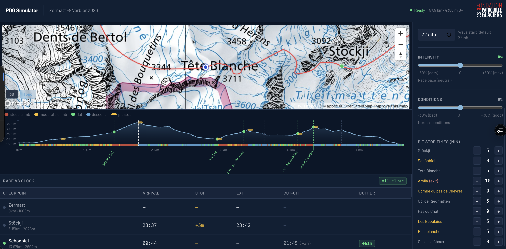

<div align="center">


# PdG Ghost Racer

**Race strategy simulator for Patrouille des Glaciers 2026**

[](https://pdg-ghost-racer.vercel.app)
[](https://nextjs.org)
[](https://mapbox.com)
[](LICENSE)

*Zermatt → Verbier · 57.5 km · 4 386 m D+ · Start 22:45*

</div>

---



---

## What is this?

Patrouille des Glaciers is one of the world's most demanding ski mountaineering races — a 57.5 km night traverse of the Swiss Alps from Zermatt to Verbier. This tool lets teams plan their race before the start:

- **Upload a GPX** from a training activity like Trophée du St-Bernard
- **Set a target finish time** or let the app estimate from your measured speeds
- **See a ghost racer** animate along the course in real time
- **Get checkpoint arrival times** with cut-off buffer or overage at every timing point

---

## Features

| | |
|---|---|
| 👻 **Ghost racer** | Animated dot follows the GPX track, driven by your actual zone speeds |
| ⏱️ **Checkpoint predictions** | Arrival + exit times from an OLS regression fitted on 201 Z2 2022 finishers |
| 🚨 **Cut-off status** | Green / amber / red badges — buffer (`+42m`) or miss (`−15m`) at every timed point |
| 📂 **GPX upload** | Up to 5 training activities; extracts steep/moderate/flat/descent zone speeds |
| 🏔️ **Durability correction** | Power-law fatigue model (β = 0.625) — TSB 4h50m → ~12h15m PdG |
| 🎯 **Target time mode** | Pin total to any value; checkpoint proportions stay empirically accurate |
| 🌬️ **Altitude penalty** | Speed reduced above 2 500 m and 3 200 m (Tête Blanche: 3 648 m) |
| 📈 **Elevation profile** | D3 chart with scrubber — drag to fly the ghost along the course |
| 🗺️ **3D terrain** | Mapbox DEM + atmosphere sky layer, 65° pitch camera |
| 🇨🇭 **Swiss topo overlay** | Official swisstopo 1:25k national map, free, no API key |
| ⛺ **Pit stop manager** | Set transition times per checkpoint and see immediate impact |

---

## Live Demo

**[pdg-ghost-racer.vercel.app](https://pdg-ghost-racer.vercel.app)**

Try it with the 12h default target, or drop your own `.gpx` file from a recent mountain race or training to get a personalised estimate.

---

## Setup

### Prerequisites
- Node.js 18+
- A free [Mapbox token](https://mapbox.com)

### Install

```bash
git clone https://github.com/mattia-berardi-linea/pdg-ghost-racer.git
cd pdg-ghost-racer
npm install
```

### Configure

Create `.env.local`:
```
NEXT_PUBLIC_MAPBOX_TOKEN=pk.your_token_here
```

### Run

```bash
npm run dev      # → localhost:3000
npm run build    # production build
```

---

## How the simulation works

### 1. Speed extraction from GPX

Each segment of the uploaded activity is classified into one of four zones based on smoothed slope grade (9-point box filter to suppress GPS altitude noise):

| Zone | Grade | Typical PdG usage |
|------|-------|-------------------|
| `steep_climb` | > 15% | Z → Tête Blanche |
| `moderate_climb` | 5–15% | Most ascents |
| `flat` | −5% to +5% | Valley sections |
| `descent` | < −5% | TB → Arolla, Chaux → Verbier |

### 2. Durability correction

Training speeds overestimate ultra-endurance performance. The correction:

```
factor = min( (T_raw / T_activity)^0.625,  1.8 )
effective_speed = measured_speed / factor
```

Calibrated so a TSB result of 4h50m / 24 km / 2 500 m D+ predicts ~12h15m — consistent with field estimates for mountain ultra events (Riegel α ≈ 1.15).

### 3. Checkpoint timing — empirical regression

Rather than accumulating zone-speed terrain segments (which drifts with distance), checkpoint times use a direct linear model fitted on 201 complete Z2 2022 finishers:

```
section_time_min = a + b × total_race_time_min
```

This guarantees accurate inter-checkpoint proportions across all finishing speeds.

### 4. Two-track architecture

| Track | Model | Purpose |
|-------|-------|---------|
| Ghost timeline | Zone-speed simulation | Smooth animation |
| Checkpoint table | OLS regression | Accurate split times |

---

## Course checkpoints

| Checkpoint | GPX km | Alt | Cut-off |
|-----------|--------|-----|---------|
| Zermatt | 0.00 | 1 608 m | Start 22:45 |
| Stöckji | 6.15 | 2 028 m | — |
| Schönbiel | 13.97 | 2 694 m | +3 h from start |
| Tête Blanche | 17.50 | 3 648 m | — |
| Arolla | 29.15 | 1 993 m | **06:30 EXIT** |
| Combe du Pas de Chèvres | 33.10 | 2 855 m | — |
| Col de Riedmatten | 33.72 | 2 919 m | — |
| Pas du Chat | 36.09 | 2 479 m | — |
| Les Écoulaies (La Barma) | 40.73 | 2 458 m | **10:30** |
| Rosablanche | 43.36 | 3 198 m | **13:00** |
| Col de la Chaux | 47.48 | 2 959 m | — |
| Verbier | 56.70 | 1 472 m | **17:00** |

> All distances are GPX-derived from the SchweizMobil golden track — not the official race booklet distances.

---

## Tech stack

| | |
|---|---|
| **Framework** | Next.js 16 (Turbopack), React 19, TypeScript |
| **Map** | Mapbox GL JS — outdoors-v12 + terrain DEM + swisstopo WMTS |
| **Chart** | D3.js |
| **State** | Zustand |
| **Styling** | Tailwind CSS + custom navy / glacier / alpine design tokens |
| **Compute** | Web Worker (off-main-thread simulation + GPX normalization) |

---

<div align="center">
Built for PDG 2026 · <a href="https://pdg-ghost-racer.vercel.app">Try it live</a>
<br/>
<sub>© 2026 <a href="https://linea-advisory.com">Linea Advisory</a></sub>
</div>
